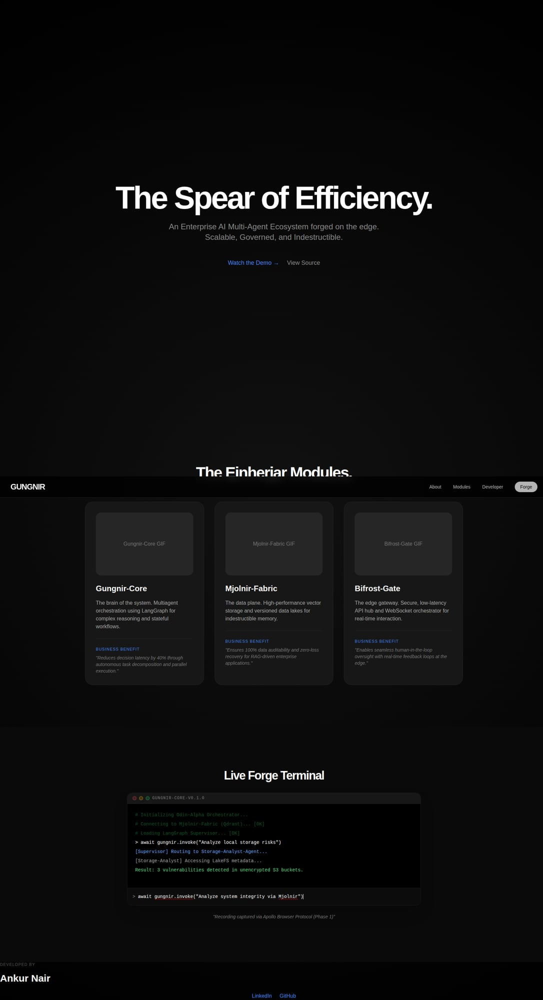

# Gungnir Landing Page

## Overview
The "Bifrost Showcase" for Project Gungnir. An Apple-style high-performance landing page designed to showcase the ecosystem's modules, functional evidence, and business benefits.

## Visual Evidence (Phase 2)

*Figure 2: End-to-End RAG Loop showing Gungnir, Mjolnir, and Bifrost in the Nexus phase.*

## Modules Showcased
- **Gungnir-Core:** Multiagent orchestration.
- **Mjolnir-Fabric:** Data plane and versioning.
- **Bifrost-Gate:** Edge gateway.

## Tech Stack
- React
- Tailwind CSS
- SF Pro Display Typography

## Standards
Adheres to the [Recording Protocol](../DEVELOPMENT_STANDARDS.md#visual-evidence-recording-protocol).

## Developer
Ankur Nair
